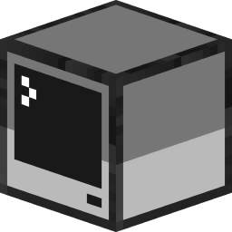

<h1 align="center">Launcher</h1>

---

### **<ins>
Fonctionnalitées du launcher :
**

- ✅ Mise à jour automatiques via github.

- 🔴 Option pour mettre le launcher en maintenance.

- 🔒 Authentification Microsoft.

- 🟢 Statut serveur complet.

    - Opérationnel ou hors ligne.
    
    - Nombres de joueurs connectés.

- ☕ Installation de Java automatique.

    - Si vous avez installé une version incompatible de Java, nous installerons la bonne pour vous.
    
    - Vous n'avez pas besoin d'avoir Java installé pour exécuter le launcher.

---

### **<ins>
Téléchargement :
**

Vous pouvez télécharger le launcher à partir des [Releases GitHub](../../../releases).

Plateformes supportées :

- Windows 
- Linux
- MacOS

Si vous téléchargez à partir des Releases, sélectionnez le programme d'installation de votre système.

 Plateforme | Fichier |
| -------- | ---- |
| Windows x64 | `Selvania-Launcher-win-x64.exe ` |
| macOS x64 | `Selvania-Launcher-mac-x64.dmg` |
| macOS arm64 | `Selvania-Launcher-mac-arm64.dmg` |
| Linux x64 | `Selvania-Launcher-linux-x86_64.AppImage` |

---